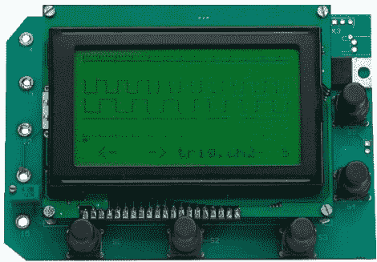

# 四通道逻辑分析仪

> 原文：<https://hackaday.com/2010/04/17/four-channel-logic-analyzer/>

如果你身边有一个图形液晶显示器，你可以用几把便宜的元件建造这个四通道逻辑分析仪。[Ronald de brui jn]的设计使用 PIC18F4580 对最多四个逻辑输入进行采样，最大分辨率为 2 MHz。他包括了 PCB 插图，这样你就可以蚀刻你自己的电路板。身边有一个逻辑分析仪真的可以让你的生活更轻松，允许你[逆向工程通信协议](http://hackaday.com/2010/04/16/hijacking-the-mazda-lcd-display/)和解决你自己的设计问题。

[谢谢胡安]