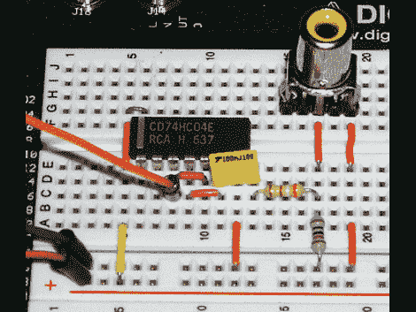

# FPGA 产生的 SPDIF 输出

> 原文：<https://hackaday.com/2011/07/12/fpga-generated-spdif-output/>

[Mike Field]刚刚在 FPGA 上实现了[SPDIF 代。SPDIF 是传输数字音频信号的行业标准；首字母缩写代表索尼/飞利浦数字互连格式。它已经存在了十多年，因为它可以在大多数家庭音频设备上找到，在您的项目中构建 SPDIF 输出可能是一个非常理想的功能。[Mike]提到了这一功能的几个想法，如构建高端测试设备，或为电子仪器提供高质量输出。](http://ec2-122-248-210-243.ap-southeast-1.compute.amazonaws.com/mediawiki/index.php/SPDIF_out)

他首先开始分析规格，以确定硬件要求。由于抖动的一些问题，他发现有必要使用 100 MHz 的时钟信号。这将抖动降低到+/- 5ns 的抖动，他承认这可能会引起音频纯化论者的不满，但确实满足了发布的标准。输出只需要 FPGA 的一个引脚和上面看到的五个元件。六角逆变器(74HC04)分压器、电容器和 RCA 连接器将 0.5V 信号传输到您选择的音频接收器。当然，由于 TOSLINK 光纤连接器使用相同的协议，您可以重新设计输出，使其成为光纤连接。