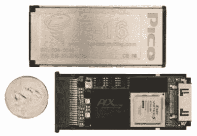
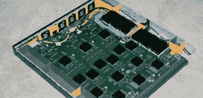

# FPGA 项目综述

> 原文：<https://hackaday.com/2008/05/22/fpga-projects-roundup/>

最近，FPGA 对黑客社区变得特别有用。曾几何时，这些可爱的专用硬件被传说为只有财大气粗的显卡制造商才能获得，他们正在努力增加着色器和顶点数量。如今，它们经常出现在高端网络设备的内部。作为可重编程的逻辑门阵列，FPGAs 代表了通用 CPU 和专用芯片之间的一个中间地带。休息之后，我们将讲述一些我们见过的更有趣的 FPGA 项目，比如我们昨天介绍的[开源显卡](http://www.hackaday.com/2008/05/21/open-graphics-card-available-for-preorder/)。

一些我们喜欢的 FPGA 工作已经由【h1kari】完成。我们参加了他在[的几次会议](http://www.hackaday.com/2008/02/15/shmoocon-2008-intercepting-gsm-traffic/)，他的团队已经在[发布了几个使用 FPGAs 破解各种加密方案的项目](http://openciphers.sourceforge.net/oc/)。最近，他一直在主持[破解 GSM 手机网络使用的 A5 加密](http://www.hackaday.com/2008/02/15/shmoocon-2008-intercepting-gsm-traffic/)节目。他们使用相当高端的卡，如 [Pico E-16](http://www.picocomputing.com/products/cards/e16.php) ，但代码当然可以适用于低端硬件。

【skylark】还没有他的网络界面(但是你可以通过 irc 友好地问他)来允许他的 [NSA@home 项目](http://www.hackaday.com/2007/08/31/nsa-home-diy-shared-fpga-cracker/)的开放使用。他将一些基于 HDTV FPGA 的编码板改造成了 SHA-1 专用的密钥破解系统。

没有什么比完全效仿真的老硬件更高端的了。很久以前我们介绍的的 minimig(mini Amiga 的简称)已经发展成为一个生产质量板，[的完整源代码](http://www.amiga.org/modules/news/article.php?storyid=7386)已经发布。进化的图片可以在[这里](http://www.amiga.org/modules/myalbum/viewcat.php?uid=12811)找到。

如果你对着手 FPGA 项目感兴趣，别忘了细读[John Kent]的[文档集](http://members.optushome.com.au/jekent/FPGA.htm)。我们见过的最接近入门级项目的东西是这个基于大约 150 美元 FPGA 套件的 [24 通道逻辑分析仪](http://www.hackaday.com/2007/09/27/usb-2-0-fpga-based-24-channel-logic-analyzer/)。