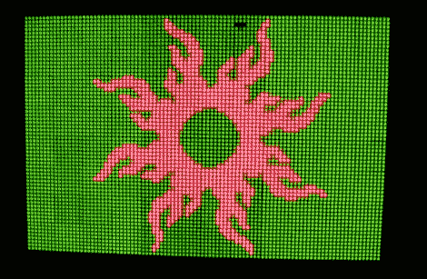

# FPSLIC 供电的 LED 矩阵

> 原文：<https://hackaday.com/2010/08/19/fpslic-powered-led-matrix/>

马修建造了这个显示器，希望他能在上面玩乒乓球。你可以想象当试图找出如何驱动 6144 双色 led 时等待着你的头痛。我一定是锻炼出来了，因为休息后视频里的东西看起来棒极了。他选择的解决方案对我们来说有点陌生。他使用了由 Atmel 生产的[现场可编程系统级集成电路，或 FPSLIC。这是一种我们更熟悉的组件的混搭。](http://www.atmel.com/products/fpslic/)

AT94K 是一款单芯片，内置一个 8 位 AVR 微控制器、FPGA 和 SRAM。这个项目使用 FPGA 通过用 VHDL 编写的代码来处理显示器的多路复用。AVR 内核通过 USB 端口接收数据，在 SRAM 中存储两幅图像(每种 LED 颜色一幅)，然后输出到显示器上绘制。仔细想想，这个项目听起来很有趣，而且是开始学习你一直拖延的 VHDL 的好方法。T3[https://www.youtube.com/embed/5PH4c5tr6Ss?version=3&rel=1&showsearch=0&showinfo=1&iv_load_policy=1&fs=1&hl=en-US&autohide=2&wmode=transparent](https://www.youtube.com/embed/5PH4c5tr6Ss?version=3&rel=1&showsearch=0&showinfo=1&iv_load_policy=1&fs=1&hl=en-US&autohide=2&wmode=transparent)