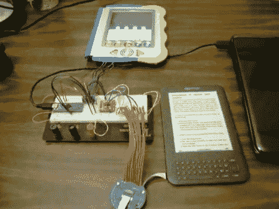

# FrankenKindle:构建备用 Kindle 键盘

> 原文：<https://hackaday.com/2011/07/28/frankenkindle-building-an-alternate-kindle-keyboard/>

如果你曾经认为 Kindle 的键盘有点窄，你并不孤单。很长一段时间以来，格伦一直致力于为 Kindle 开发外置键盘。它可能不会让每个人都更容易使用，但他有动力为他患有脑瘫的妹妹提高可用性。

我们看到许多键盘黑客直接焊接到按钮下的衬垫上，但对于像 Kindle 这样的紧凑型设备来说，这真的会把事情弄糟。[Glenn]没有走那条路，而是找了一个 [20 针柔性扁平电缆和分线板](http://breadboardconfessions.blogspot.com/2011/03/christmas-in-march.html)来匹配内部 Kindle 连接器。上面看到的原型使用 TS3A5017 串行多路复用器芯片来模拟键盘按钮按压。该多路复用器由 Teensy++微控制器板驱动，该板监控上图所示的 V.Reader 上的大量按钮。休息之后，看看视频中的简短演示，然后看看[Glenn]的其他博客文章，看看开发周期的不同步骤。

[https://www.youtube.com/embed/2V5_qZqcM3k?version=3&rel=1&showsearch=0&showinfo=1&iv_load_policy=1&fs=1&hl=en-US&autohide=2&wmode=transparent](https://www.youtube.com/embed/2V5_qZqcM3k?version=3&rel=1&showsearch=0&showinfo=1&iv_load_policy=1&fs=1&hl=en-US&autohide=2&wmode=transparent)

[谢谢杂交蓝]