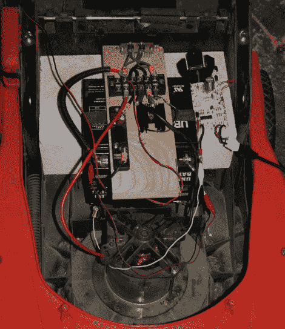

# 弗兰肯斯坦的割草机

> 原文：<https://hackaday.com/2011/04/28/frankensteins-lawnmower/>

[phantompinecone]有一台电动割草机，工作了大约 4 个季节，然后电池开始没电。安装了替代品，但在第一季后开始变得很痛苦。既然电池是全新的(可能也很贵)[一定还有别的什么东西](http://phantompinecone.wordpress.com/2011/04/24/frankensteins-lawnmower/)。

检查刷子，没问题，下一个合乎逻辑的地方是开关。这些割草机只是一个电池、马达和开关。把它拉开确实有问题，它们被咬烂和腐蚀，不允许完全的电接触。所以[phantompinecone]用 MOSFET 取代了简单的机械开关。

在电气方面，有一个 IRF1405 MOSFET、一些用于传输信号的电阻和一对二极管，以 A)控制电机的反电动势，B)将进入 FET 的电压从 24 伏降至 12 伏。问题解决了，马达应该不会再有由废弃开关引起的问题了。