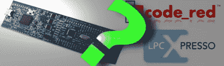

# 免费(…就像“免费啤酒”)手臂套件

> 原文：<https://hackaday.com/2011/02/19/free-as-in-free-beer-arm-kit/>

恩智浦基于 ARM 的解决方案占据了很大的市场份额。这就是为什么当我们在他们的网站上发现一个链接，宣布他们正在免费赠送基于他们的 [Cortex-M0](http://www.arm.com/products/processors/cortex-m/cortex-m0.php) 系列的[LPC xpresso](http://www.nxp.com/campaigns/cortex-m0/index.php?sub=gallery)[开发板](http://hackaday.com/2011/02/01/what-development-board-to-use/)时，我们有点惊讶。

接球？不幸的是，有几个让板装运和运行。为此，您必须…

*   注册一个公司的电子邮件地址
    …这个宣传片是针对工程师的
*   使用随主板
    …提供的损坏的 IDE，因为很难找到(不存在？)集成 LPC-Link 的文档
*   将物理销毁竞争电路板的原始视频上传到恩智浦网站

虽然杀死你的 Arduino 听起来可能不是最有趣的，但一些合格的读者可能会对以难以匹敌的价格移动到 32 位感兴趣。