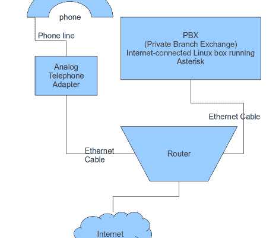

# 免费家庭电话方法使用我们熟悉的部分

> 原文：<https://hackaday.com/2011/03/18/free-home-phone-method-uses-parts-were-familiar-with/>

[Headsheez]找到了一种免费获得家庭电话服务的方法。他正在使用一套我们熟悉的工具，通过服务器将服务从典型的模拟电话系统(包括接入您家中的分机)路由到互联网。在硬件方面，首先是一个模拟电话适配器，它转换模拟信号用于 PBX 系统。他使用了一个名为 Asterisk 的开源 PBX 项目的副本，我们也看到了[在路由器](http://hackaday.com/2005/05/10/asterisk-pbx-on-wrt54g/)和 [SheevaPlug](http://hackaday.com/2010/01/20/sheevaplug-pbx/) 等设备上使用该项目。实际的电话号码来自一个谷歌语音账户，该账户目前是免费服务，但不能保证它在未来会保持这种状态。

这应该提供无缝服务，就像你习惯了传统的家庭电话线。甚至有来电显示号码，但没有来电显示姓名。这种设置缺少的一个重要特征是紧急情况下拨打 911 的能力。

[via [Reddit](http://www.reddit.com/r/linux/comments/g5bbn/howto_free_home_telephone_service_with_debian/)