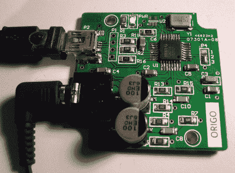

# 从参考设计到 USB 声卡

> 原文：<https://hackaday.com/2012/03/14/from-reference-design-to-usb-sound-card/>

[Entropia]决定尝试滚动自己的声卡。他挑选了一个 DAC 芯片，通过研究数据手册中的参考设计开始了他的原型制作，然后[经历了几次迭代才得到这个工作模型](http://entropia.kapsi.fi/blog/2012/03/designing-a-usb-sound-card/)。

他选择将电路板基于 PCM2706。这是一个数模转换器，内置 USB 支持；完全符合他的需求。它有一个耳机放大器，但也能够输出 S/PDIF 信号，供数字放大器拾取和使用。对于一个八块钱左右就能买到的角色来说，这已经不错了。

他设计的第一个 PCB 有一些电气和尺寸错误。但他通过添加一些点对点跳线，并弯曲电容器的腿以适应电路板面积，使它能够运行。他订购了第二批电路板。这些配合得很好，但耳机输出的声音大得令人难以置信。结果是滤波电路的电阻和电容值不正确。改变它们，并交换音频输出，以便正确的通道被修补到音频插孔，使其成为上面看到的第一个发布版本。