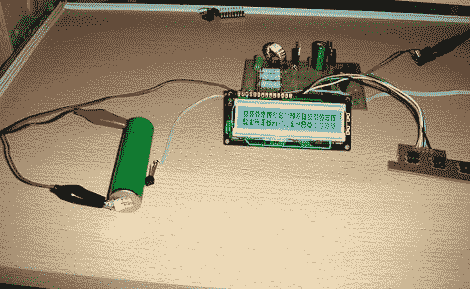
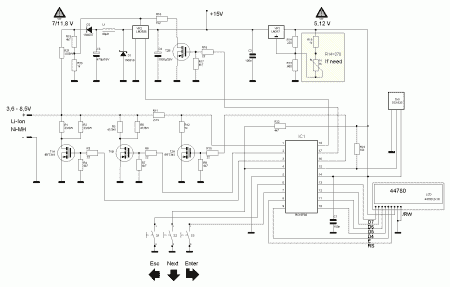

# 全功能电池测试仪让他们通过他们的步伐

> 原文：<https://hackaday.com/2011/04/14/full-featured-battery-tester-puts-them-through-their-paces/>

在处理依赖电池的项目时，您需要准确的性能信息，而数据手册可能不可用。[E. Lelic]开始建造一种可以测量内部电池电阻的设备，但最终得到的是一种可以做更多事情的工作台工具。

PIC 16F88 微控制器是电表的核心，它读取电压电平，监控 DS1820 温度传感器，并控制 LM2575 降压调节器。这些组件提供测量锂离子、锂聚合物、镍镉、镍金属氢化物和碱性电池的功能。它能够对电池进行完全放电和完全充电，测量该周期中的时间和功耗，并监控 NiMH 和 NiCad 版本的温度变化。

在上面链接的文章底部寻找红色的“下载”图标。该档案包括一个原理图(我们也在休息后嵌入)，电路板布局。层格式和十六进制固件文件。

如果你喜欢这个版本，你可能想看看另一个电池容量测试仪。

