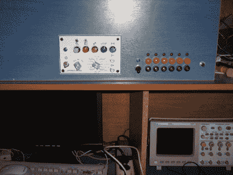

# 函数发生器内置并安装在电子工作台内

> 原文：<https://hackaday.com/2011/03/27/function-generator-built-and-mounted-inside-electronics-bench/>

一个函数发生器是一个方便的现场测试设备。【kam menos】[设计并建造了自己的函数发生器](http://pcbheaven.com/projectpages/High_Frequency_Function_Generator/?p=0&topic=worklog)，使用工作台本身作为外壳。你可以看到上面的控制面板呈现出干净的外观。为了做到这一点，[Kammenos]设计并在一张纸上印刷了面板标签，并使用了一片丙烯酸来保护它。里面的电路使用了一个 MAX038 高频发生器芯片。这是一款全功能器件，可以基于几个外部元件实现强大的控制。其中之一是基于一个引脚电容值的可选频率范围。这可以通过十二级旋转开关和十几个不同的上限值来选择。还有微调、占空比和 DC 偏移的调节旋钮。

休息之后，请观看视频，观看完整的演示。如果你想自己构建它，你需要寻找一些芯片。MAX038 已经过时了。你可能仍然能够找到一个，但在 20 美元左右，你应该能够找到一个具有相同功能的替代品，并节省自己的现金。

[https://www.youtube.com/embed/rSryBvvFmBw?version=3&rel=1&showsearch=0&showinfo=1&iv_load_policy=1&fs=1&hl=en-US&autohide=2&wmode=transparent](https://www.youtube.com/embed/rSryBvvFmBw?version=3&rel=1&showsearch=0&showinfo=1&iv_load_policy=1&fs=1&hl=en-US&autohide=2&wmode=transparent)

[谢谢里奇]