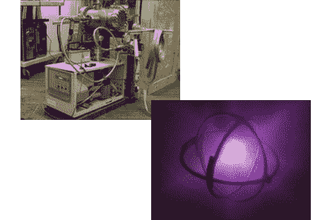

# 聚变，在我家后院？！

> 原文：<https://hackaday.com/2010/06/24/fusion-in-my-backyard/>

这是建在地下室的第 32 座业余核聚变反应堆。[马克·苏佩斯]紧随其后的是[【威尔·杰克】](http://hackaday.com/2010/02/19/basement-fusion-reactor/)，(当时)17 岁的[【蒂亚戈·奥尔森】](http://hackaday.com/2007/03/18/make-your-own-fusion-reactor/)， [，【米利厄斯】](http://hackaday.com/2010/06/19/arc-reactor-replica/) 在设计一个自制的核反应堆。取两个轻元素，在极高的速度和压力下碰撞，产生一个更重的元素和能量。

[马克]的目标是吸引投资者，以赚取足够的钱来建造一个更大的[布萨尔德反应堆](http://en.wikipedia.org/wiki/Robert_W._Bussard)，这将有望产生与其消耗一样多的能量。只需几百万美元的免费能源；谁*不会*放过这个机会？

[谢谢小鬼]