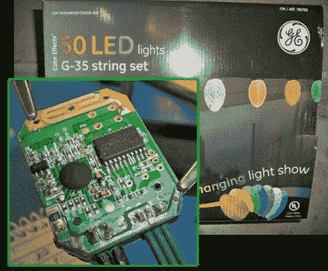

# G-35 电路板色情

> 原文：<https://hackaday.com/2011/11/29/g-35-circuit-board-porn/>

[托德·哈里森]拍摄了大量照片，试图解开 G-35 圣诞灯的所有秘密。这是一串 50 个塑料灯泡，里面装有可单独寻址的 RGB 发光二极管。我们已经看到了大量使用它们的项目，从大约一年前的[原始逆向工程](http://hackaday.com/2010/12/01/hacked-led-christmas-lights/)到最近的[制造 7×7 LED 矩阵](http://hackaday.com/2011/11/07/g-35-christmas-lights-do-make-a-great-led-matrix/)。但是大多数情况下，最初的控制板会立即被丢弃，用于替换。这已经变得如此普遍，以至于你现在可以买一个插入式主板，不需要黑客攻击。我们喜欢[托德]对电子产品的认真审视。

库存控制器使用单层单面纸板。有一个树脂块芯片，还有一个 SOP-20 微控制器。由于[托德的]在他的房子上使用了几串灯，他想知道是否有可能改进控制器，以便同步这些灯串。他的调查显示，该板被设计为主机晶体振荡器，但它是空的。不幸的是，你不能只添加这些部分来改善芯片的时序(固件也需要改变)。他发现有一个按钮的位置。快速短接焊盘会循环显示效果，长时间短接会关闭灯串。有无线控制，但似乎它提供的唯一功能与无人开关相同。

我们喜欢电路板的特写照片，我们喜欢他用来把灯固定在仪表板上的间隔夹具。休息之后，我们嵌入了一个关于他的功绩的长视频。

[https://www.youtube.com/embed/q7znaoj-0xA?version=3&rel=1&showsearch=0&showinfo=1&iv_load_policy=1&fs=1&hl=en-US&autohide=2&wmode=transparent](https://www.youtube.com/embed/q7znaoj-0xA?version=3&rel=1&showsearch=0&showinfo=1&iv_load_policy=1&fs=1&hl=en-US&autohide=2&wmode=transparent)