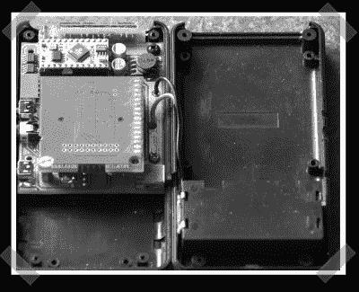

# G-force 记录器，带视频同步

> 原文：<https://hackaday.com/2007/04/07/g-force-logger-wvideo-sync/>

【马库斯】送来了他相当有趣的[重力记录器](http://web.telia.com/~u38401419/)。他已经发布了大部分内容，但是还没有发布你需要的所有信息。最有趣的部分是摄像机时间同步。他使用 SD 开发板进行数据记录，并使用加速度计产生数据。最新版本的特点是可选的内部和外部传感器和体面的尺寸缩小。我希望看到像这样的东西结合高灵敏度的 GPS 传感器来记录跳伞或滑翔。

*   [永久链接](http://web.telia.com/~u38401419/)