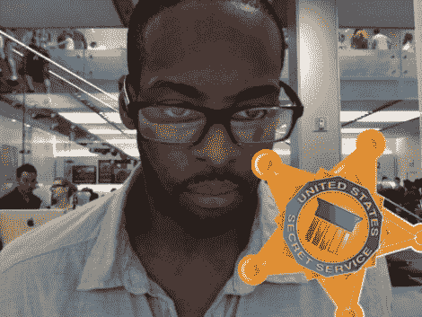

# 联邦探员拜访了凯尔·麦克唐纳

> 原文：<https://hackaday.com/2011/07/08/g-mean-pay-kyle-mcdonald-a-visit/>

看起来黑衣人已经拜访过凯尔·麦克唐纳了。美国特勤局正在调查他为[他的人民盯着电脑项目](http://hackaday.com/2011/07/07/smile-your-face-is-on-the-internet/)的欺诈和相关活动。我们昨天才看了一眼那个人，感谢他所做的只是给人们拍照，而不是窃取他们的信息。看起来[山姆大叔]并没有这么仁慈——或者可能是苹果公司抱怨了，因为妈妈们听到了这个公司巨头的话。在征求了[电子前沿基金会](http://www.eff.org/)的建议后【凯尔的】也[保持沉默](http://twitter.com/#!/kcimc/status/89072716916858880)。

由于细节匮乏，是时候扮演纸上谈兵的律师了。请在评论中让我们知道你认为(凯尔)可能会面临什么，以及我们是否会看到这件事进入法庭。记住不要把这些评论当成法律建议，因为我们都不知道自己在说什么。

顺便说一句，上面看到的这位先生不是[凯尔]，他是一些[维基共享](http://en.wikipedia.org/wiki/File:US-SecretService-StarLogo.svg)的不知情的“受害者”之一。

[感谢克雷格、大卫和其他人]