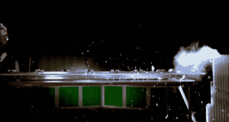

# 高斯武器

> 原文：<https://hackaday.com/2011/02/23/gauss-weapons/>

这套高斯武器使用稀土磁铁将射弹加速到毁灭性的速度。它们使用与线圈枪相同的概念工作，但不是只有一个射弹沿着一段导轨行进，而是有许多射弹以连锁反应的方式工作。一系列磁铁沿着轨道等距离放置。每一个在磁铁的枪口一侧都有一对大滚珠轴承。第一个滚珠轴承是使用机械力发射的，就像弹簧机构一样，当它靠近磁铁时，由于磁场的吸引力而加速。当它撞击磁铁时，它会将另一侧的一个滚珠轴承送到轨道上，当它靠近链条中的下一个磁铁时，它会在轨道上加速。上面的武器达到了大约 68 英里每小时的最终抛射速度，打破了设备右侧连续的六个荧光灯管。

还是更喜欢使用电磁铁的轨道炮？看看这个高斯手枪套件，它的威力和 BB 枪差不多。