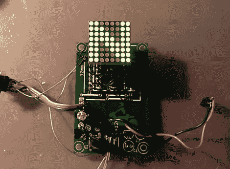

# 铃木摩托车档位指示器

> 原文：<https://hackaday.com/2010/11/15/gear-indicator-for-suzuki-motorcycle/>

这个小板子作为摩托车的当前档位指示器。它的设计考虑到了铃木 V-Storm 摩托车，因为它们在变速箱中内置了一个传感器。[其他档位指示器](http://hackaday.com/2010/06/04/motorcycle-current-gear-indicator/)依靠换档器上的传感器，但从变速箱传感器读取电压水平会提供更可靠的信息。

电压测量由 ATmega88 微控制器处理，该微控制器进而驱动 8×8 LED 显示器。该系统还内置了温度传感器和光敏电阻。固件利用这两种输入，在第六档或按下按钮时显示温度，并根据环境光调暗显示器。还有屏幕旋转和用户偏好的设置。

我们没有找到原理图或软件，但这应该很容易复制。如果你需要 AVR 编程的入门知识[，我们已经为你准备好了](http://hackaday.com/2010/10/23/avr-programming-introduction/)。

[谢谢迈克尔]