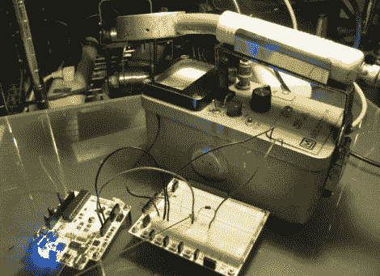

# 辐射水平众包的盖革计数器 A/D 转换

> 原文：<https://hackaday.com/2011/03/23/geiger-counter-ad-conversion-for-radiation-level-crowdsourcing/>

[Akiba]和东京 Hakerspace 的工作人员仍在努力工作，试图在日本最近的地震、海啸和持续的核危机后帮助他们的同胞。你可能记得这个团体，因为他们是我们上周报道的和服灯笼项目[的幕后黑手。这一次，他们的努力集中在把有用的信息提供给需要的人。](http://hackaday.com/2011/03/16/tokyo-hackerspace-helping-disaster-victims)

在所有关于核辐射的讨论中，他们想看看在东京能得到什么样的测量结果，但是他们在附近的任何地方都找不到盖革计数器。幸运的是，他们最终能够从爱达荷州的博物馆找到两个旧柜台。一个被借给个人，以检查他们家的辐射水平是否安全，但另一个被决定将居住在户外，以收集空气中的辐射读数。

[Akiba]想把外部盖革计数器的结果放到[PAC hube](http://community.pachube.com/node/608)上，但是这些旧的装置都是模拟的。他认为，进行模数转换的一种快速而肮脏的方法是监控计数器扬声器发出的啁啾声。这是通过将 Arduino 连接到扬声器导线上，并记录扬声器每次被激活的时间来实现的。这导致了精确的数字辐射读数，与计数器的模拟显示相匹配。Arduinio 将信息无线发送到位于他公寓内的另一个 Arduino，后者随后将数据上传到 Pachube。

在他的网站上可以找到他的转换过程以及 Arduino 计数器和 Pachube uploader 的源代码，以防东京地区的其他人也有 Geiger 计数器并希望这样做。