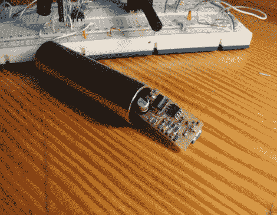

# 产生粉红噪声

> 原文：<https://hackaday.com/2011/05/24/generating-pink-noise/>

[Miceuz]刚刚完成了他的第一个表面贴装电子项目。这是一个用于测试音频设备的粉红色噪音发生器。

粉红噪声介于红色噪声和白色噪声之间。没意识到除了白色，还有更多颜色来营造噪音吗？使用[粉红噪声](http://en.wikipedia.org/wiki/Pink_noise)进行测试的好处是，音频信号的功率在声音的每个倍频程中都是稳定的——白噪声的功率会随着每增加一个倍频程而增加，这会损坏音响系统中的高音扬声器。

该设计目标是构建一个适合 XLR 连接器的噪声发生器。[Miceuz]从一个现有的设计开始，并修改它以适应他的需要。很像[电容麦克风](http://hackaday.com/2009/04/22/condenser-microphone-building/)，粉红噪声发生器使用幻像电源，而不是独立电源。例如，他以此为基础的设计需要两节 9v 电池。大小，选择的情况下，没有电池都拼写为这个项目的胜利。