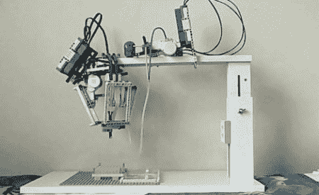

# 用乐高进行基因测试

> 原文：<https://hackaday.com/2011/10/11/genetic-testing-with-lego/>

大约在 2009 年，来自互联网黑暗角落的 [BioBrick-A-Bot](http://2009.igem.org/Team:Washington-Software/) 诞生了，这是一个为分子生物学家设计的液体处理系统。

2009 年的 iGEM 竞赛是一场为合成生物学制造设备的学生竞赛。BioBrick-A-Bot 的目标是建立一个简单、低成本的液体处理系统，将液体从培养皿中吸取到小瓶中。

像大多数实验室设备一样，这项技术的商业版本非常昂贵——一个商业液体处理机器人大约要 1 万美元。生物砖机器人几乎完全由乐高零件制成，因此整个系统的成本降低到大约 700 美元。

生物砖机器人有两个主要部分。[阿尔法模块](http://2009.igem.org/Team:Washington-Software/Project#Module_ALPHA)在[德尔塔平台](http://www.parallemic.org/Reviews/Review002.html)上装有四个吸管，在之前我们已经见过这种用乐高[建造的机器人，但是移动液体是一个新领域。Phi 模块包含将微升液体吸入移液管并将其吐出到小瓶中的所有机制。](http://hackaday.com/2011/04/20/amazing-quad-pick-and-place-system-tirelessly-sorts-your-legos/)

生物砖机器人没有赢得 2009 年 iGEM 竞赛(该荣誉由来自[剑桥](http://partsregistry.org/cgi/partsdb/pgroup.cgi?pgroup=iGEM2009&group=Cambridge)的学生获得)，但我们会在一周的任何一天带上一个乐高机器人。休息后请欣赏演示。

[https://www.youtube.com/embed/FRijFX0BpGI?version=3&rel=1&showsearch=0&showinfo=1&iv_load_policy=1&fs=1&hl=en-US&autohide=2&wmode=transparent](https://www.youtube.com/embed/FRijFX0BpGI?version=3&rel=1&showsearch=0&showinfo=1&iv_load_policy=1&fs=1&hl=en-US&autohide=2&wmode=transparent)

感谢[Okian]发送此邮件。