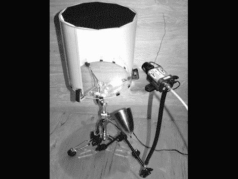

# 轻轻地敲击这个鼓

> 原文：<https://hackaday.com/2010/04/19/gently-stroke-this-drum/>

[无声鼓](http://www.jaimeoliver.pe/instrumentos/silent-drum/sd-text)是用手打的。它通过分析橡胶黑色鼓面的运动来充当 midi 设备。照片中可以看到，身体的一边是透明的，另一边是白色的。一束光照射到它身上以增强对比度，当它经过贝壳的白色一侧时，一架照相机拍摄下黑色的头部。[Jaime Oliver]为我们提供了一个有趣的视角，让我们来看看这款乐器使用的[分析方法](http://www.jaimeoliver.pe/instrumentos/silent-drum/sd-parameters)，还有一个[系统，为未来的演奏标注一首乐曲](http://www.jaimeoliver.pe/instrumentos/silent-drum/sd-notation)。休息后在演示中看到和听到它的播放。

[https://www.youtube.com/embed/2kLVqgUMGSU?version=3&rel=1&showsearch=0&showinfo=1&iv_load_policy=1&fs=1&hl=en-US&autohide=2&wmode=transparent](https://www.youtube.com/embed/2kLVqgUMGSU?version=3&rel=1&showsearch=0&showinfo=1&iv_load_policy=1&fs=1&hl=en-US&autohide=2&wmode=transparent)

[谢谢以利亚]