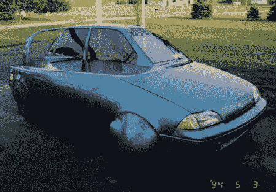

# Geo Metro 减半以获得更好的里程

> 原文：<https://hackaday.com/2008/06/16/geo-metro-halved-for-better-mileage/>

【道格·赫夫朗】早在 1993 年就改装了这辆 1989 年的 Geo Metro。汽油价格刚刚开始突破 1.00 美元/加仑，他想向制造商展示如何在这样的困难时期制造一辆省油的汽车。这辆车已经达到了 58 英里/加仑(普锐斯:46 英里/加仑)，但[道格]认为他可以在空气动力学方面做些改进。这辆车被改装成双人座，去掉了多余的重量。在它的最终形式中，它达到了 75 英里/加仑，但随后油价稳定下来，它被放在一个棚子里休息。你可以找到更多关于这辆车的信息，并在它的网站上看到[的照片](http://1989geometro.com/index.html)(痛苦的尺寸调整)。

[通过[自动博客](http://www.autoblog.com/2008/06/16/blue-1989-geo-metro-has-been-green-since-1993/)

*   [永久链接](http://www.autoblog.com/2008/06/16/blue-1989-geo-metro-has-been-green-since-1993/)