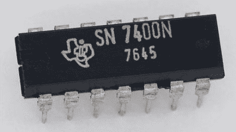

# 拿出图表纸，开始新的离散逻辑竞赛

> 原文：<https://hackaday.com/2011/09/02/get-out-the-graph-paper-get-started-on-the-new-discrete-logic-contest/>

这是另一个展示你的黑客技能来赢取现金和奖品的机会。危险原型刚刚宣布 [Open 7400 逻辑竞赛](http://dangerousprototypes.com/open-7400-logic-competition/)。一等奖是 100 美元和一堆黑客物品。但更好的是，自从它被宣布以来，更多的赞助商已经加紧增加小猫，以及将获得奖品的条目数量。

进入的参数是开放的。想设计什么都可以，重点是原创。确保你拍了大量的照片，并记录了整个项目。他们的评判将会考虑到发布的关于该项目的细节数量(因此竞赛标题中的“开放”)。

需要一些想法让你开始吗？我们喜欢使用 7400 与非门的无用机器。你总是可以建造一个类似于[这种无微控制器时钟](http://hackaday.com/2010/04/03/clock-sans-microcontroller/)的计时器。也许像[这种步进电机驱动器](http://hackaday.com/2011/07/11/building-a-stepper-driver/)这样的硬件控制更合你的意？

[谢谢摩登男孩]