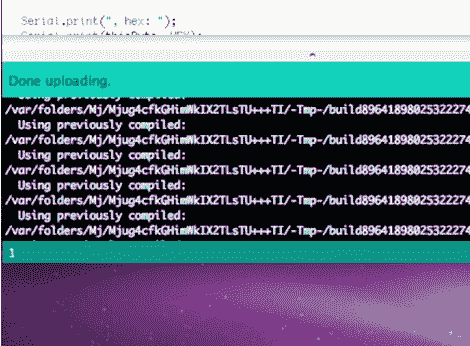

# 从 Arduino 编译过程中取得领先

> 原文：<https://hackaday.com/2011/09/13/get-the-lead-out-of-the-arduino-compile-process/>

为您的 Arduino 项目开发固件时，长时间的编译时间会让您松一口气。[Paul]感到困惑的是，每次点击上传时，草图中使用的每个文件都会完全重新编译——即使文件没有改变。更令人困惑的是，这种行为在所有 Arduino 兼容的硬件上并不一致。Teensy 还有一个与其他硬件板配合使用时看不到的特性，即如果没有任何变化，它会重用以前编译的代码。它甚至会告诉你哪些文件正在被重用，如上图所示。

休息之后，我们嵌入了[Paul 的]视频，带我们完成了编辑 Arduino IDE 以重用之前编译的文件的过程。这是对 boards.txt 文件的一行补充。例如，如果您正在使用 Arduino Uno，那么只需添加“uno.build.dependency=true”。[Paul]之前已经提交了一个补丁，将这个问题加入到 Arduino IDE 源代码中，但是没有被接受，理由是需要进行更多的测试。他在寻求测试方面的帮助，并希望你在他就此功能开放的新[问题上发表你的想法或任何错误信息。](http://code.google.com/p/arduino/issues/detail?id=638) [https://www.youtube.com/embed/2dBF1ypQupM?version=3&rel=1&showsearch=0&showinfo=1&iv_load_policy=1&fs=1&hl=en-US&autohide=2&wmode=transparent](https://www.youtube.com/embed/2dBF1ypQupM?version=3&rel=1&showsearch=0&showinfo=1&iv_load_policy=1&fs=1&hl=en-US&autohide=2&wmode=transparent)