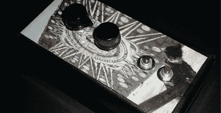

# getlofi 的 Dub Siren

> 原文：<https://hackaday.com/2008/06/24/getlofis-dub-siren/>

[GetLoFi](http://www.getlofi.com/) 一直是我们寻找弯道乐趣的第一站之一。他们的最新项目是[用一个制造噪音的钥匙链制造这个简单的配音警报器](http://www.getlofi.com/?p=1118)。配音警报器或拉斯特盒是雷鬼配音的标志性声音。这个项目的基础是一个八音钥匙链。每个衬垫都连接到一个八位选择器开关。俯仰电阻用线性电位计代替。一个按钮用于替换原来的八个按钮，另一个用于静音。将 1/4 英寸的插孔插入延迟踏板，你就可以开始摇滚了。看看下面的视频，看看这个特殊的盒子在使用中。

<http://www.youtube.com/v/1E2KZCWZsHM&amp;hl=en&amp;rel=0&amp;color1=0x3a3a3a&amp;color2=0x999999>

*   [永久链接](http://www.getlofi.com/?p=1118)