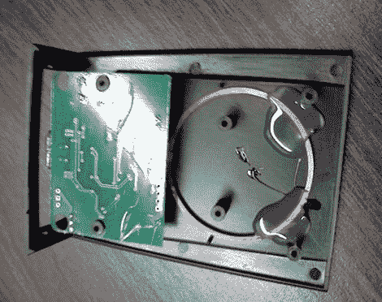

# 从非常便宜的 RFID 阅读器中获取有用的数据

> 原文：<https://hackaday.com/2011/11/19/getting-useful-data-from-a-dirt-cheap-rfid-reader/>

[Aaron]正在寻找一种便宜的 RFID 阅读器,它有一些易于遵循的文档和标准化的界面。他看到的几乎所有东西都很贵，所以他决定从易贝买一个便宜的 10 美元的阅读器，看看它有多容易使用。

阅读器附带的文档很少，但[Aaron]确实知道该设备将自己标识为 USB 键盘，将扫描标签数据输出到文本编辑器中。这个功能并不是非常有用，所以他把它拆开，看看是否能以其他方式与之交互。暴露 PCB 后发现了一个未知的 IC，他找不到相关的文档，但电路板上确实有一些分线引脚，所以[Aaron]从探测这些引脚开始寻找数据。

他尝试在终端程序和逻辑分析仪中读取数据，但似乎都没有什么意义。他调低了嗅探器的采样率，情况开始有所好转。在将来自嗅探器的数据与已知的标签代码进行比较后，他注意到每个数字都应用了 39 的偏移量，因此他快速编写了一些代码来纠正这些数字。

[Aaron]做了大量的跑腿工作，从读者那里获得有用的数据，但 10 美元的成本是无与伦比的。我们当然知道今天下午我们将在易贝寻找什么…