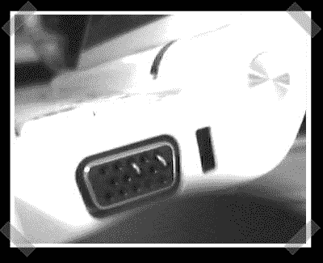

# Ghost 外部 VGA 显示器黑客

> 原文：<https://hackaday.com/2008/04/26/ghost-external-vga-display-hack/>

某些 OS 安装人员 cough*osx*cough 不喜欢某些机器上的板载显示屏。【齐丹】[在 eeeuser 论坛上发布了](http://forum.eeeuser.com/viewtopic.php?id=7562)一个基于回形针的作品(最初由【穆根】发布在 insanelymac 上)。显然，通过短路引脚，视频卡将报告有未知的外部显示器连接。

*   [永久链接](http://forum.eeeuser.com/viewtopic.php?id=7562)