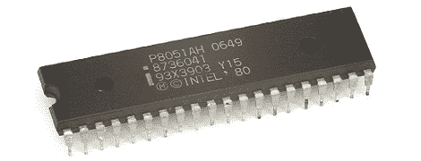

# 带着 8051 去守旧派

> 原文：<https://hackaday.com/2012/03/09/going-old-school-with-an-8051/>

不久前，[马特]买了几个 8051 单片机，并把它们藏起来，以备将来的项目使用。他刚刚在一个组件抽屉里发现了这些难以置信的小芯片，并决定是时候找出这些家伙了。最终，[Matt]偶然发现了这个关于 8051 编程的极好资源。

8051 的特点是仍然相当可观的 4k ROM 和 128 字节 RAM——与今天的产品没有太大区别，直到你意识到这个 30 岁的芯片有 32 个 IO 引脚。这个微控制器和它的兄弟 8052 一起，成为事实上的微控制器标准长达 20 年。毫无疑问，你曾经坐过二手车，在早期的个人电脑中，你甚至被用来做低级的体力工作。

[Matt]说他找不到一个以这个 30 岁的微控制器为特色的黑客项目(不是真的，这是那些[倾斜迷宫](http://hackaday.com/2010/05/11/maze-solving/)和[电子收费站](http://hackaday.com/2011/02/17/electronic-tolling-system/)中的一个)，但即使是我们也不得不承认，除了通常的 AVR 和 PICs，我们没有太多特色。尽管已经 32 岁了，8051 家族仍然有一些锦囊妙计，比如[播放音乐 CD](http://www.8052.com/users/jsno/)。如果你手头有一个 8051 项目，[在提示行](http://hackaday.com/contact-hack-a-day/)提交它，我们很可能会放弃它。