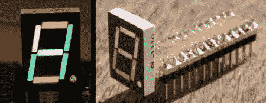

# 采用 7 段显示屏的 RGB

> 原文：<https://hackaday.com/2011/10/22/going-rgb-with-7-segment-displays/>

我们可以全天订购红色、绿色、黄色或蓝色的七段显示屏。有一件事我们还没有看到，那就是 RGB 分段显示器，所以[Markus]的项目真的很有趣。他把一个普通的七段显示器改装成一个 [RGB 显示器](http://www.jave.de/blog2/?p=7) 

在把一个 Dremel 拿到股票展示区的后面后，[Markus]只剩下一个七段光罩。一些贴片发光二极管是通过正常渠道购买的。RGB LEDs 一次一个地用环氧树脂固定在光罩的背面。幸运的是，led 已经附有电磁线，这很有帮助，因为这些 led 只有 1.6 毫米 x 1.2mm 毫米大。

有了 32 根磁线，[马库斯]需要某种插座。一小块 perfboard 和一些 0.100 英寸的头非常好地处理了这项工作。[Markus]仍然需要以某种方式驱动他的 LED 显示器的 24 条阴极线。他希望有一个 I2C 接口，但如果有一个单独的七段显示器，电路的尺寸应该很小。如果你有任何建议，请写在评论区。[马库斯]肯定会在那里抓住他们。