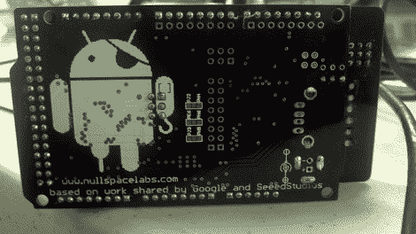

# 谷歌 ADK 克隆版包含一些额外的功能，希望比原版便宜得多

> 原文：<https://hackaday.com/2011/08/01/google-adk-clones-pack-a-few-extra-features-hopefully-far-cheaper-than-the-original/>

来自 Null Space Labs 的[charliex]来信分享了他和其他人在过去几周一直在做的一个项目。该团队一直在重新混合和构建我们今年早些时候看到的谷歌 ADK 演示板的克隆，希望在 Defcon 19 之前准备好一大批。

他们的版本对原来的版本做了细微的改变，例如 Mega AVRs 的额外标题行，更高质量的 RGB LEDs，以及一个漂亮的盗版 Android 徽标。他们还增加了电路板发送和接收红外信号的能力，使其可以用作电视，以及更有成效的追求。用于 ADK 的 Arduino 板只经历了小的修改，其中大部分是与布局相关的。

[charliex]没有提到他们改进的 ADK 板的价格，但我们猜测他们会比谷歌官方版本便宜很多。与此同时，请访问他们的网站，获取这些电路板在不同建造阶段的大量图片和视频。