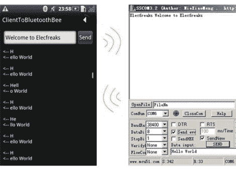

# 谷歌安卓 ADK 蓝牙无线通信

> 原文：<https://hackaday.com/2011/06/30/google-android-adk-bluetooth-wireless-communications/>

谷歌 ADK 一经宣布，[ElectFreaks]的团队就投入进来，开始试验看看他们能用新的 Arduino/Android 界面做些什么。虽然 ADK 很好地允许两个设备通过 USB 连接进行交互，但他们觉得如果系统允许无线通信而不是 T1 会好得多。

他们在 Arduino 设置中添加了一个蓝牙蜜蜂，并忙于编写一个 Android 应用程序，该应用程序使用手机内置的蓝牙模块通过 ADK 进行通信。该应用程序将您的手机配置为配对时充当客户端或服务器。这不会影响数据流，因为通信是双向的，它只是决定将哪个设备置于可发现模式。

正如你在他们帖子的第二部分[中看到的，一旦手机和 Arduino 连接上，在两个设备之间来回发送串行数据就相当容易了。](http://www.elecfreaks.com/829.html)

到目前为止，他们的蓝牙 API 还在测试阶段，所以事情可能还有点粗糙。他们鼓励任何人下载和修改代码，这些代码可以在他们的网站上免费获得。