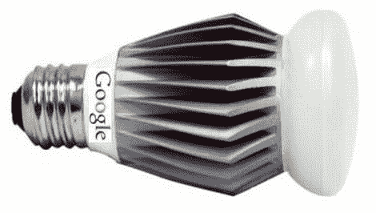

# 谷歌？在我的灯泡里？这比你想象的更有可能

> 原文：<https://hackaday.com/2011/05/11/google-in-my-lightbulbs-its-more-likely-than-you-think/>

随着他们的 ADK 最近的宣布和发布，谷歌开始大规模入侵你的家只是一个时间问题。从表面上看，[谷歌将很快进入家庭照明市场](http://inhabitat.com/google-unveils-brilliant-android-controlled-led-light-bulb/)，这可能会非常有趣。

谷歌与佛罗里达州的 Lighting Sciences 合作，计划开发消费级 60W 等效智能 LED 灯泡。这些灯泡将能够使用谷歌新的开源家庭网络协议进行无线通信。这些灯可以使用任何 Android 设备进行控制，允许用户在不接触墙壁开关的情况下调光、变亮和开关灯。

我们认为这是一个有趣的想法，我们都支持在家里安装优质的 LED 照明。也就是说，谷歌的其他一些以公用事业为中心的努力，如 PowerMeter，只取得了一般的成功，所以这一概念是否会成功还有待观察。然而，如果它真的发生了，我们迫不及待地想看到这个社区汇集的大量 ADK 黑客。由于他们的新无线协议可能会扩展到所有其他种类的家庭系统，这种可能性是无限的。