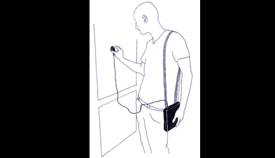

# 地面扬声器为您带来的 GPS 音频之旅

> 原文：<https://hackaday.com/2011/09/06/gps-audio-tour-brought-to-you-by-surface-speakers/>

Eschelle Inconnue 的团队想要在法国马赛“追踪伊斯兰的声音地图”,所以他们想出了一个聪明的小 [GPS 徒步旅行](http://www.echelleinconnue.net/outils/mobio/?lang=en),由 Arduino、MP3 播放模块和表面传感器扬声器供电。

该团队使用一个处理应用程序来定义每个 MP3 文件将播放的地理区域。构建中的 Arduino 查询 GPS 模块并从 MP3 播放模块中选择音频文件。这并不罕见，许多大型户外博物馆(想想战场)都有类似的设置。

决定在哪个位置播放哪个音频是相当容易的，但这并不是这个版本的特别之处。该团队决定使用一个能够将任何固体材料转化为扬声器的表面扬声器，而不是简单地将一副耳机挂在建筑上。从文字记录来看，这应该是“通过给人错觉来收集声音，听墙壁的声音，材料中的低语”但我们认为这只是让几个人同时听同一音频文件的一种很好的方式。