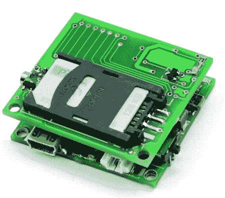

# 不带 GPS 的 GPS

> 原文：<https://hackaday.com/2011/06/14/gps-without-gps/>

Open Electronics 刚刚发布了一个简洁的小板子[可以在不使用 GPS](http://www.open-electronics.org/mini-gsm-localizer-without-gps/) 的情况下将你定位在地图上。

该委员会根据手机网络的基本原理工作——“蜂窝”网络是一系列彼此等距放置的发射塔。除了该国最荒凉的地区，手机信号塔通常与一两英里外的电话通信。通常，可以看到几个信号塔，因此可以在 200-350 英尺内确定手机的位置。通过查询为手机版谷歌地图创建的谷歌数据库，可以很容易地将手机信号塔转换为经度和纬度。

电路板本身是一个 PIC18 微控制器和一个 SIM900 GSM 模块。Open Electronics 提供的固件令人印象深刻——所有与电路板的通信都是通过短信处理的，手机可以向其他 8 部手机报告其位置。

令人印象深刻的是，抓住了[【凯文·米特尼克】](http://massis.lcs.mit.edu/archives/security-fraud/kevin.mitnick.captured)的同样技术现在也能为大众所用。我们想知道读者会用它来做什么，所以如果你有什么想法，请留下评论。