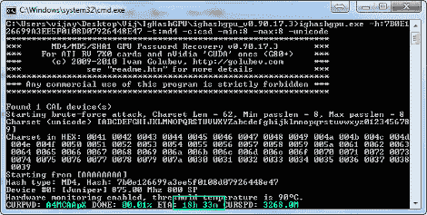

# GPU 密码破解变得简单

> 原文：<https://hackaday.com/2011/06/01/gpu-password-cracking-made-easy/>

当试图破解密码时，图形处理单元的能力可以用来做一些肮脏的工作。[Vijay]查看了一些破解密码的选项，发现[利用 GPU 可以在](http://mytechencounters.wordpress.com/2011/04/03/gpu-password-cracking-crack-a-windows-password-using-a-graphic-card)的一小部分时间内生成正确的密码。在一台 Windows 机器上，他让使用 CPU 进行计算的 [Cain 密码恢复工具](http://www.oxid.it/cain.html)与使用 ATI 或 Nvidia 显卡进行计算的 [ighashgpu](http://www.golubev.com/hashgpu.htm) 进行了较量。毫无疑问，ighashgpu 是最快的；Cain 需要大约一年的时间来破解一个八个字符的密码，而 ighashgpu 可以在 19 个小时内完成。

我们非常感兴趣地想知道使用这个包有多简单。[我们在九月份关注了 GPU 破解](http://hackaday.com/2010/09/27/gpu-processing-and-password-cracking/),但没有关注现有的软件包。现在你知道你的密码有多容易被发现，也许你会从[这篇文章中得到一些用处，这篇文章讨论了我们在](http://www.baekdal.com/tips/password-security-usability) [Reddit](http://www.reddit.com/r/geek/comments/grfny/why_this_is_fun_is_10x_more_secure_a_password/) 上偶然发现的更长密码的可用性和安全性。