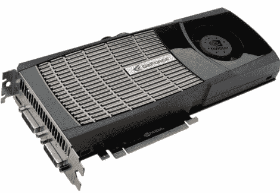

# GPU 处理和密码破解

> 原文：<https://hackaday.com/2010/09/27/gpu-processing-and-password-cracking/>

最近，佐治亚理工学院的研究生发布了一份报告，概述了 GPU 对当前密码安全状态造成的危险。有许多破解密码的方法，都有不同的优缺点，但归根结底，所有这些方法的限制因素是处理的复杂性。需要运行的操作越多，花费的时间就越长，每个工具对破解密码的用处就越小。过去，大多数关于密码安全的建议都围绕着确保您的密码不是可预测的东西，比如“密码”或您的生日。对于今天(以及未来)的 GPU，这可能已经不够了。

虽然这篇文章没有提到他们的名字，但密码破解的最新工具是基于两个工具，nVidia 的 CUDA 和 T2 AMD 的 Stream SDK。这些工具允许用 C 语言编写程序，这些程序可以被分解并利用通常为图形优化的硬件的并行特性。由于这种并行布局，GPU 在大规模数学运算方面比 CPU 强得多。机会是，如果你有一个[有点新的](http://www.nvidia.com/object/cuda_gpus.html)图形卡，它可能与 CUDA 或 Stream 兼容，如果你已经知道 C，你就有了开始使用的所有必要工具。

这里要吸取的教训是，密码越长或越复杂，通常就越安全。正因为如此，许多工具，包括软件和硬件，可能会变得越来越流行，或者说是必要的，来适应这种需求。