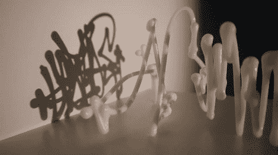

# 涂鸦分析

> 原文：<https://hackaday.com/2010/09/28/graffiti-analysis/>

这是一个引人入胜的项目，开始于一个伟大的想法，积累了大量的创新。[涂鸦分析](http://graffitianalysis.com/)是一个项目，它捕捉用于创建涂鸦艺术的手势，并通过一种称为涂鸦标记语言的数据类型将其编码( [GML](http://graffitianalysis.com/gml/) )。休息之后，您可以观看一段视频，展示该项目 2.0 版本中使用的数据采集方法。贴在光源上的标记被用来在一张纸上画涂鸦标签。这张纸放在一个有机玻璃的绘画表面上，下面有一个网络摄像头跟踪，以捕捉每个动作。

最新的版本 3.0 有一些令人难以置信的特性。添加音频输入意味着标记可以基于声音进行投影和动画制作，例如涂鸦与烟花表演的交互。3D 工具也非常神奇，不仅可以播放立体视频，还可以使用 3D 打印机打印涂鸦标记。新功能的集合是如此之大，并产生如此惊人的结果，很难用语言来表达。所以我们也在休息之后嵌入了新发布版本的演示。

涂鸦分析 3.0

[https://player.vimeo.com/video/13327615](https://player.vimeo.com/video/13327615)

涂鸦分析 2.0

[https://player.vimeo.com/video/7283422](https://player.vimeo.com/video/7283422)

[谢谢 BoBeR182]