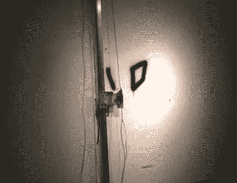
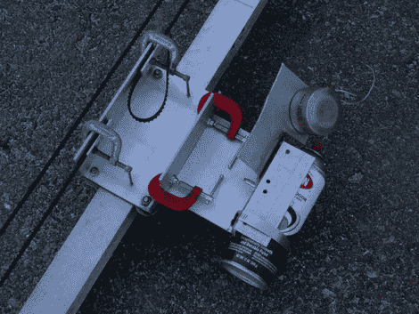
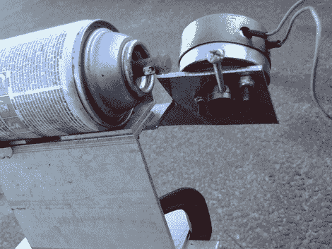
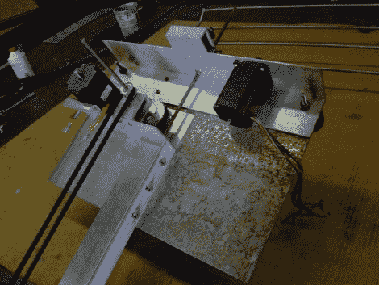
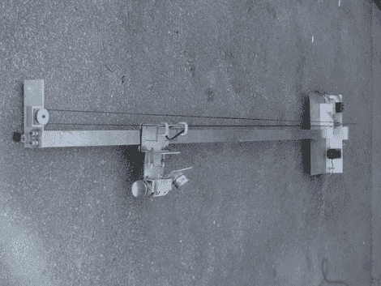
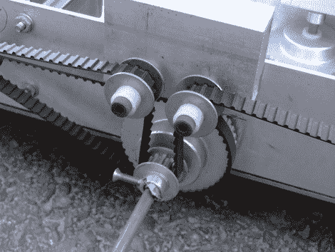
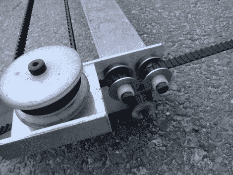
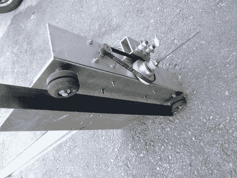
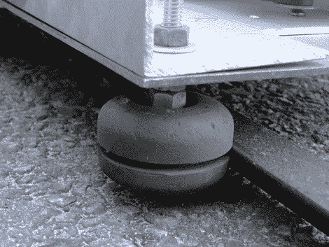

# 涂鸦机为你喷雾

> 原文：<https://hackaday.com/2010/03/19/graffiti-machine-sprays-for-you/>

(本的)父亲是一名金属工人，他一生中的大部分时间都在从事金属制造，并获得了几个艺术学位，这两者结合在一起带来了令人满意的黑客技能。上面你可以看到一个他建造的[涂鸦机器](http://www.youtube.com/watch?v=5uFsZEqCBV4)，休息后我们会深入观察它..这不是他工作过的第一台数控机床。[Ben]开始对快速原型制造感兴趣，但商业切割机的成本让他却步，这让他建造了自己的[数控等离子切割机](http://www.youtube.com/watch?v=w1rdh4aSIfY)。

[https://www.youtube.com/embed/5uFsZEqCBV4?version=3&rel=1&showsearch=0&showinfo=1&iv_load_policy=1&fs=1&hl=en-US&autohide=2&wmode=transparent](https://www.youtube.com/embed/5uFsZEqCBV4?version=3&rel=1&showsearch=0&showinfo=1&iv_load_policy=1&fs=1&hl=en-US&autohide=2&wmode=transparent)

[Ben]的发明包括一个垂直的门架，里面装有电机和喷漆“拨浪鼓”的支架。他用步进电机和皮带来移动托架和门架，控制器是他从 [HobbyCNC](http://www.hobbycnc.com/) 那里拿来的。让我们看看他是如何把这一切联系在一起的。

这是罐头盒。在右边，罐子的上方，你可以看到用来启动和停止油漆流动的马达。在左边，你可以看到用来上下移动马车的同步带。它的两端用 C 形夹固定。

[Ben]用一个机器螺丝的头压下拨浪鼓的阀门。

龙门架的顶部装有电机，用于移动龙门架本身以及罐托架。

完整的门架是一个整体，罐架沿其长度方向移动。你可以看到齿轮用来移动罐子的同步带。

上图显示了用于沿顶部和底部水平轨道移动机架的皮带。一根杆沿着门架的长度移动，由一端的步进电机驱动，以移动顶部和底部传送带的齿轮。

此图像显示了用作轨迹的尖括号。这赋予了机器横向可伸缩性。

这个特写展示了一个滑板轮子，轮子上有一个切槽。这使机架在移动时牢牢地固定在轨道上。

[Ben]将系统与运行[增强型机器控制器](http://www.linuxcnc.org/)的 Linux 系统捆绑在一起。他希望有一天在涂鸦对决中让人类和机器对决。这是一个伟大的建设[本]，感谢与我们分享细节。