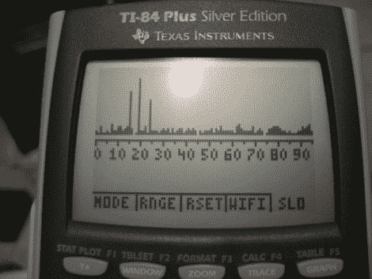

# 作为频谱分析仪的图形计算器

> 原文：<https://hackaday.com/2010/07/29/graphic-calculator-as-a-spectrum-analyzer/>

[迈克尔·文森特]把他的 [TI-84 Plus 变成了频谱分析仪](http://www.michaelv.org/programs/calcs/sa.php)。通过在设备上运行一些汇编代码，链接端口可以用作 I2C 总线(我们必须记住这一点)。在受到[手机频谱分析仪](http://hackaday.com/2010/02/12/spectrum-analyzer-wedged-into-a-cellphone/)的启发后，他开始构建一个与计算器兼容的模块，使用 I2C 端口扩展器与无线电接收器模块接口。现在，他可以嗅出 2.400 到 2.495 GHz 之间的信号，并显示如上图所示的发现。

[谢谢塞西尔]