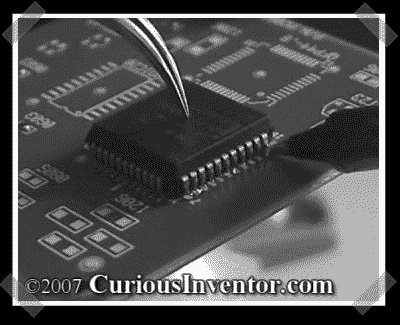

# 表面贴装焊接入门

> 原文：<https://hackaday.com/2008/01/08/great-intro-to-surface-mount-soldering/>

【Scott】在他的视频中发来了关于[表面贴装焊接](http://www.curiousinventor.com/guides/Surface_Mount_Soldering/101)的操作方法。宏观视频质量非常好，演示也很棒，即使你已经进入 SMD 工作。使用优质焊料、合适的焊接站、镊子、10 倍放大镜和精选的助焊剂，一切都可以完成。我在没有外部通量的情况下完成了相当多的 SMD 工作，但这种演示显示了它是多么有效。

*   [永久链接](http://www.curiousinventor.com/guides/Surface_Mount_Soldering/101)