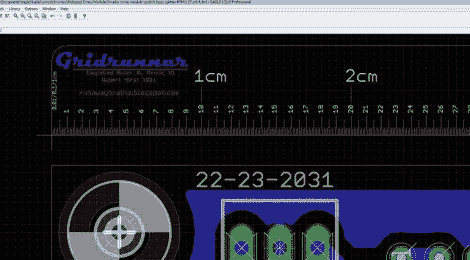

# grid runner:Eagle CAD 中用于测量的自定义零件

> 原文：<https://hackaday.com/2011/11/20/gridrunner-a-custom-part-for-measuring-in-eagle-cad/>

[Koogar]提出了一个有用的工具，用于检查 Eagle CAD 中布局的尺寸。他称之为 Gridrunner[为您的设计添加 200 毫米标尺的定制部件](http://runawaybrainz.blogspot.com/2011/11/electronics-eagle-pcb-gridrunner.html)。当配合 Eagle 的缩放功能使用时，刻度线以 1/10 毫米为增量，以获得更高的精确度。一旦你得到了正确的布局，从你的设计中删除标尺，并将其导出用于制作。[Koogar]确实提到了[鹰 6](http://hackaday.com/2011/11/05/cadsofts-eagle-6-hits-beta-and-packs-goodies/) 的测试版有一个新的测量工具，但他仍然认为 Gridrunner 提供了一些内置工具没有的东西。休息之后，看看视频中它有多方便。大约 1:40 开始测量。

我们发现有趣的是，[Koogar]在 PCB 设计之外还使用 Eagle。我们以前曾用它来设计面板的钻孔模板，但他远不止于此。他使用库编辑器重新创建了他的 CNC 机器的部件，他说这些部件很容易对准。从那里，他导出用于安装支架的 CAM 文件。你用 Eagle 做 PCB 设计以外的事情吗？请留言告诉我们。

[https://www.youtube.com/embed/zyM7w1vkevs?version=3&rel=1&showsearch=0&showinfo=1&iv_load_policy=1&fs=1&hl=en-US&autohide=2&wmode=transparent](https://www.youtube.com/embed/zyM7w1vkevs?version=3&rel=1&showsearch=0&showinfo=1&iv_load_policy=1&fs=1&hl=en-US&autohide=2&wmode=transparent)

[谢谢鲁伯特]