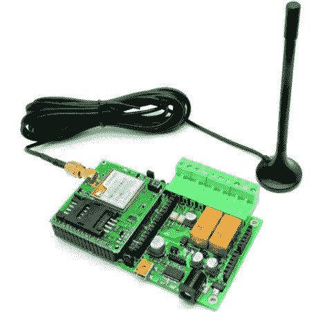

# 使用 TiDiGino 的 GSM 遥控器

> 原文：<https://hackaday.com/2012/01/06/gsm-remote-control-with-the-tidigino/>

如果您想远程控制房子周围的东西，但不能通过互联网或无线网络进行，蒂吉诺可能就是您想要的。 [Boris Landoni]来自 Open Electronics，在 TiDiGino 上向我们发送了一些信息，如果您需要一个坚固的 GSM 遥控模块，它看起来肯定是一个有用的设备。

TiDiGino 的核心是 ATmega2560，通常用于 Arduino Mega，因此有足够的处理能力。虽然外形与你对 Arduino 的期望略有不同，但 TiDiGino 拥有所有适当的连接，支持任何标准的 Arduino 屏蔽以及使用所需的必备库。

通过[竞赛/社区努力](http://www.open-electronics.org/tidigino-contest/)，TiDiGino 支持开箱即用的远程报警、门控、远程恒温器控制和 DTMF 远程控制功能。我们想象我们的读者也能想象出一连串的其他用途，因为 GSM 遥控器在这里很受欢迎[。](http://hackaday.com/tag/gsm/)

如果您有兴趣了解更多关于 TiDiGino 的信息，请务必访问 Open Electronics 网站——您将找到完整的 BoM 以及代码和原理图，从而轻松构建自己的 BoM。