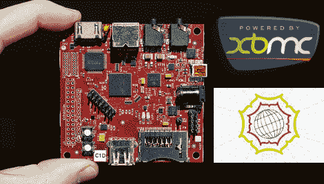

# GSoC 在 Beagleboard 迎战 XBMC

> 原文：<https://hackaday.com/2010/05/27/gsoc-takes-on-xbmc-on-the-beagleboard/>

想象一下，你把一个很小的设备 velcro 到你的电视机后面，来传送你的家庭网络上的所有媒体。自从我们看到早期的 XBMC 在猎兔犬板上奔跑的例子，我们就一直梦想着这个。从那以后，我们几乎没听到什么消息，但现在有了希望。Beagleboard 的 XBMC 优化已经被[批准为谷歌代码之夏项目](http://xbmc.org/topfs2/2010/05/24/beagleboard-project-for-gsoc-2010/)。这些项目的成果往往需要一年左右才能成熟，但我们不介意等待。

[Topfs2]是该项目的学生程序员，将会每周发布[更新](http://xbmc.org/author/topfs2/)以及在 IRC 上闲逛，所以如果你有兴趣帮助测试或者说支持的话，你应该给他写信。

[Beagleboard 照片: [Koenkooi](http://www.flickr.com/photos/koenkooi/3181365813/)