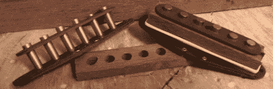

# 吉他拾音器卷绕工作站

> 原文：<https://hackaday.com/2011/08/30/guitar-pickup-winding-workstation/>

有了一点灵感后，[Pete]决定为自己打造一把实体电吉他。他计划从零开始建造一切，而不是组装现成的零件。这包括吉他拾音器，所以他为自己建造了一个[拾音器卷绕器](http://petemills.blogspot.com/2011/08/guitar-pickup-winder.html)，它可以测量 RPM、ETA 直到完成，并在拾音器完成时自动停止。

电吉他拾音器是一种简单的设备——只是一个磁铁，每根弦都包裹在数千匝大约像人类头发一样细的电线中。[皮特]从一台便宜的缝纫机开始建造，并增加了一个转速计和拾音器支架。作为一个额外的奖励，[皮特]扔在欧姆表测量线圈电阻和高斯计测量磁通量和极性的极片。这是一个非常好的建设，旨在作为商业皮卡绕线机的功能。

[皮特]最初的灵感来自于[莱斯·保罗的谷歌涂鸦](http://www.google.com/logos/2011/lespaul.html)，他计划通过制作自己的实体吉他来延续莱斯·保罗[的吉他创新传统](http://rockhall.com/education/inside-the-classroom/rockin/4tracks/video/5398/)。[木头已经切好了](http://www.youtube.com/watch?v=xYzcFceEJhk)，我们已经等不及要看最终产品了。

休息之后，请观看[Pete]的绕线机运行视频。

[https://www.youtube.com/embed/mhwhA7tNNbc?version=3&rel=1&showsearch=0&showinfo=1&iv_load_policy=1&fs=1&hl=en-US&autohide=2&wmode=transparent](https://www.youtube.com/embed/mhwhA7tNNbc?version=3&rel=1&showsearch=0&showinfo=1&iv_load_policy=1&fs=1&hl=en-US&autohide=2&wmode=transparent)