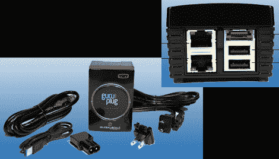

# GuruPlug，SheevaPlug 的下一代

> 原文：<https://hackaday.com/2010/02/08/guruplug-the-next-generation-of-sheevaplug/>

认识一下 GuruPlug，这是一款一体式服务器，现已[提供预购](http://www.globalscaletechnologies.com/p-32-guruplug-server-plus.aspx)。这是广受欢迎的 [SheevaPlug](http://hackaday.com/2009/02/25/sheevaplug-tiny-linux-server/) 的下一代产品，增加了一些好东西。基本型号售价同样为 99 美元，规格似乎与原始型号相同，但价格高出 30 美元，GuruPlug Server PLUS 转向 2 个千兆以太网端口，一个 eSATA 连接器，以及内置 WiFi 和蓝牙。所有这些只需 129 美元，而它只需要 5 瓦特？哇哦。

**更新:**感谢【福尔迪】和[菲尔·伯吉斯](http://hackaday.com/author/philburgess/)指出[功能页面](http://www.globalscaletechnologies.com/t-guruplugdetails.aspx#features)上的硬件图显示了两款机型的 WiFi 和蓝牙。

[谢谢克里斯]