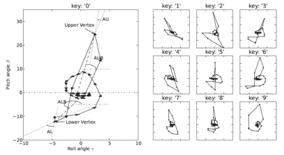

# 基于陀螺仪的智能手机键盘记录攻击

> 原文：<https://hackaday.com/2011/08/18/gyroscope-based-smartphone-keylogging-attack/>

两位安全研究人员最近公布了一种有趣的新键盘记录方法 ( [PDF 研究论文](http://www.cs.ucdavis.edu/~hchen/paper/hotsec11.pdf))，这种方法利用了一个非常不可能的智能手机组件，你的陀螺仪。

现在大多数智能手机都配备了陀螺仪，任何应用程序都可以在任何时间访问它。[陈皓和连才]能够使用安卓手机的方位数据来确定用户按下了什么按钮。这种攻击并不完美，因为研究人员只能在大约 72%的时间里辨别正确的按键，但这无疑是一个好的开始。

这种旁道攻击之所以有效，是因为智能手机上的每个按钮都有一个独特的“签名”，即每次按键时，手机都会以特定的方式倾斜。两人承认，由于按钮接近，当使用全 qwerty 键盘时，软件变得远不准确，但平板电脑上的 10 位数键盘和小键盘可以获得相对较好的结果。

我们认为这不是你真正应该担心的事情，但这仍然是一次有趣的攻击。

[谢谢你，picknicker]