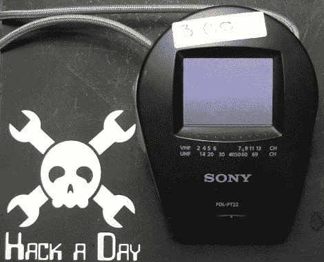
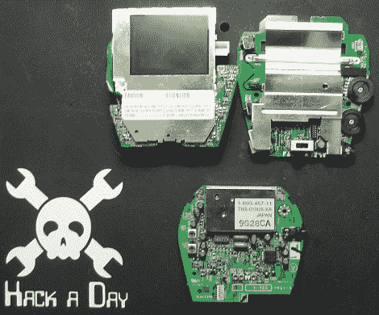
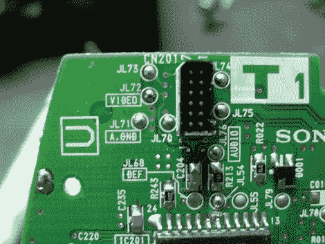
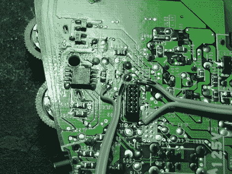
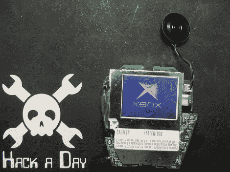
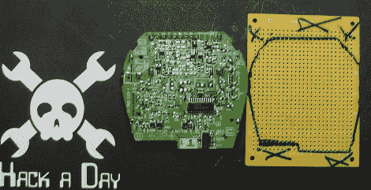
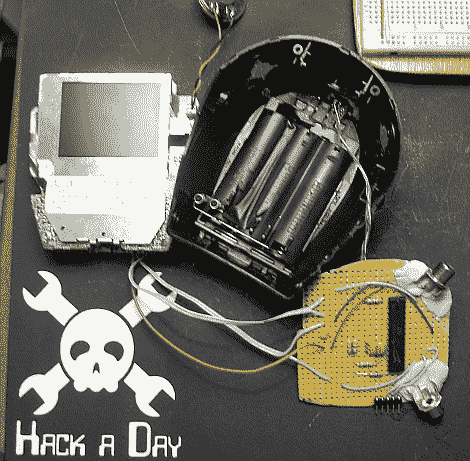
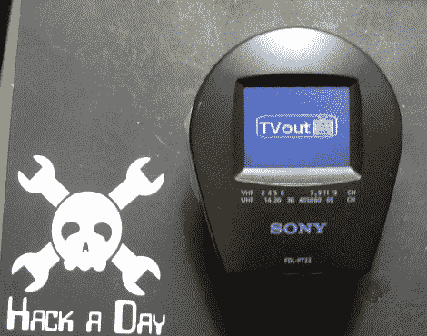
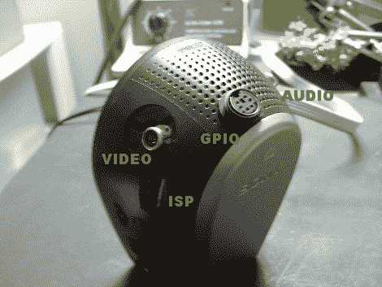

# 黑掉一个看守人

> 原文：<https://hackaday.com/2011/10/03/hack-a-watchman/>

最近，我一直在我们当地的旧货和随机旧货商店寻找一台小电视，希望能改装成一台足够适合我的 Apple //C 和 Trash80 的电脑显示器。虽然有成吨的电视，但没有一台在显像管尺寸或图像质量上真正打动我。漫游的最后一个资源，我碰巧发现这个小索尼守夜人彩色液晶电视。

当然这东西对电脑显示器来说太小了。我认为，当我在修理视频游戏系统或摆弄 Arduino 图书馆的电视时，它将是一件很棒的事情(半天 3 美元的价格标签也没有帮助)。直接走出商店，这个东西是完全无用的，因为没有输入，它的调谐器是模拟的“空中”电台，不再存在。

休息之后，请加入我，看看我是如何将这个 50 美元的镇纸变成一个实用的工作台工具的！

这里的想法是，电视调谐器在某个时候接收到的载波无线电信号被剥离，剩下的是普通的复合电视信号。找到那个地方，你就可以简单地从你喜欢的任何地方注入信号，比如视频游戏系统。

我在互联网上做了一些调查，很快就找到了这款设备的[维修手册](http://cheesefactory.us/filecenter/hadimg/SONY-FDL-PT22-SRV-MAN.pdf)，其中包含了从校准到原理图的所有内容，这确实有一点帮助，但主要是在我在电路板上戳来戳去时确认我的笔记。

当务之急是打开这个愚蠢的东西，维修手册对此帮助最大。装满了塑料夹子，我设法小心翼翼地戳和挤压外壳的接缝，最终将它打开(同时只弄断了一个夹子)。打开后，里面有三块电路板，每块电路板都相互连接，并分别夹在盒子里。

最上面的电路板包含无源矩阵 2.2 英寸液晶显示屏以及一些最终控制器电路。第二个/中间板是电源板，它包含电压调节和一个漂亮的升压电路来驱动该板上包含的荧光背光灯管(+30v)。它还包含用于音频、对比度控制以及外部控制和插孔的运算放大器。第三个也是最后一个板是所有的电视调谐器，因为原理图没有一个巨大的红色箭头说“黑客在这里！！!"那是我决定开始的地方。

起初，我认为我需要保留第三个调谐器板，并禁用调谐器。在检查了一个合适的点的原理图后，我将一根导线焊接到一个测试点上，在电路板上切了一根导线，试了试，没有结果。调谐器仍然在向 LCD 发送信号，所以我尝试了更多的点(这个东西设计得相当多余)。除了屏幕上显示的调谐器信号外，我一无所获，我心想，为什么不拔掉调谐板呢..也许它仍然有效，是的，它确实有效。

这三块板通过引脚接头连接。最重要的是，调谐器板有三个非常有用的测试点，标记为 AGND、视频和音频，而其他板没有标记。使用这些标记的测试点，我很快就能找出接头上的哪些引脚是模拟地、视频和音频，并将这些位置转换到中间电源板的插座上(然后传递到 LCD 板)。然后，我能够将这些母引脚探测到中间板上的三个测试位置，这是焊接的好地方。在我的图片中，音频在左边，视频在右边。

再次检查原理图，我确信这就是我要找的东西，从这一点上来说，音频信号只是去一个运算放大器，以驱动微型内部扬声器或耳机。视频信号被发送到整个系统中为数不多的非自有品牌芯片之一，即 [M52042FP](http://documentation.renesas.com/eng/products/assp/rej03f0180_m52042fpds.pdf) ，它将复合信号转换为 RGB 信号和单独的复合同步信号，然后发送到 LCD 控制器。

连线后，我有一张图片，但同步完全错误。根据 LCD 控制器的原理图，我发现在调谐器处，水平同步被分离并直接发送到该芯片，复合同步被发送到所有设备，然后发送到 LCD 控制器。

根据我在某处读到的某个视频 doo-dad 如果同时发送到 Hsync 和 Vsync 会产生复合同步的猜测，我将 LCD 控制器上的两个引脚焊接在一起，再试了一次。

很管用。

在这一点上，我通常会称这是一次成功的黑客攻击，但由于我从电视上移除了整个电路板，我现在有了一些发挥的空间。使用电视调谐器板作为模板，我跟踪它的轮廓到一些性能板。然后，我拿了一把钢锯，切割出 perfboard，钻了一些孔，用于 PCB 安装 RCA 插孔。

因为我做了一半，没有一个完整的千斤顶，所以我用环氧树脂加固了它。RCA 插孔的位置是这样的，它们从原来的“straptenna”出来的地方伸出来，所以我不必添加任何孔。

从那里我插上了一台 ATMEGA328P，并将其连接起来，以便与电视输出库一起使用。我还为 ISP 编程添加了一个标题，并在机箱侧面切割了一个小矩形以便访问。为了将来的控制，我还在机箱顶部添加了一个面板安装 6 针迷你 din。这是用于 PS/2 键盘和鼠标的相同风格的插头，所以我把它连接起来，使电源和接地位于 PS/2 设备的正确位置。

其他引脚连接到 328P 的引脚，通常不连接到 PS/2 端口的两个引脚连接到 328 的串行端口。这给了我 4 个 GPIO 引脚，如果我真的想制作一个分支电缆，我可以同时连接串行端口和 PS/2 键盘，作为一个袖珍串行终端。虽然它主要用于 NES 控制器。

电源由电视附带的开关控制。当我把它翻到什么是 VHF 调谐器选择，电视通电，但 AVR 没有。允许我连接外部信号源。当我翻转到超高频选择电源适用于 AVR。电视仍然依靠电池运行，并保持其“大约三小时的寿命”，尽管 99%的消耗是在荧光背光中。

仅此而已，1.50 美元的用电池运行的无用袖珍电视现在可以从过去 20 年左右制造的任何东西获得外部信号，我已经用我的新的 all in one TV out 开发平台进行了一次爆炸…尽管这些都没有帮助我的计算机监视我最初开始时的情况。我用我从 1990 年就拥有的 NEC multisync 显示器解决了这个问题，但这是一个完全不同的方法。

