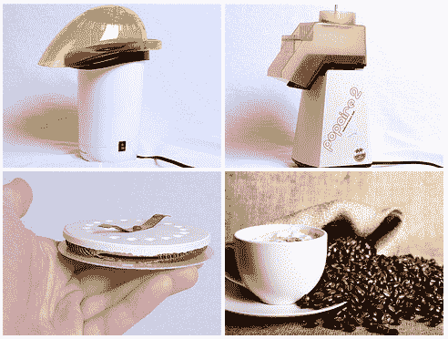

# 拼凑一个咖啡烘烤器

> 原文：<https://hackaday.com/2010/01/22/hack-together-a-coffee-roaster/>

对大多数人来说，制作咖啡需要从一罐预先研磨好的咖啡中舀几勺，加水，然后按下滴滤机上的“Go”。对其他人来说，煮咖啡是一门艺术，他们希望尽可能地控制整个过程。对于那些没有足够的银行账户来购买家用烘焙机的人来说，邪恶的疯狂科学家实验室(Evil Mad Scientist Labs)已经整理出了一个通用指南，可以用一个低成本的热空气爆米花机来组装咖啡豆烘焙器和冷却器(这显然和烘焙一样重要)。[家庭烘焙场景](http://hackaday.com/2007/12/18/pid-controlled-popcorn-popper-coffee-roaster/)甚至大到足以保证它自己的[维基百科页面](http://en.wikipedia.org/wiki/Home_roasting_coffee)，其中也提到使用爆米花机作为咖啡豆烘焙机。

该指南包括一些很棒的简单电路图，在你自己进行黑客攻击时要记住，以及一个很好的解释，为什么你不应该只剪下冷却模式的加热线圈。