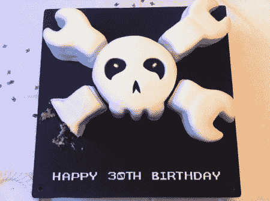
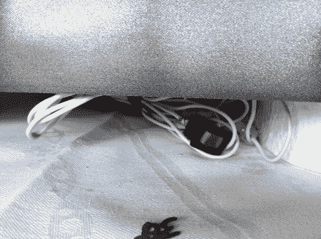

# Hackaday 生日蛋糕！

> 原文：<https://hackaday.com/2011/09/18/hackaday-birday-cake/>

亚历克斯，又名格罗文斯汀，本周末满 30 岁。在与他的姐姐交谈后，她问道:“你经常看的那个头骨网站是什么？”他想也许他会得到一张贴纸或一件衬衫。她用这个超级棒的生日蛋糕给他一个惊喜！真的没有任何建造细节，但你可以看到它的眼睛有发光二极管，还有一些疯狂的火花效果。我们印象特别深刻的是，所有的东西都是手工切割的，甚至是底部清晰的文字。生日快乐[Grovenstien]和真棒工作大姐姐！

休息之后看看剩下的照片。

