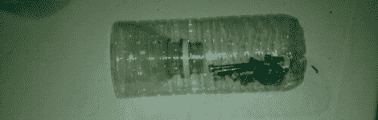

# 黑客日链接:2011 年 4 月 13 日

> 原文：<https://hackaday.com/2011/04/13/hackaday-links-april-13-2011/>

**烤箱零件搜寻**

**
**

作为对上周关于用热风枪搜寻零件的帖子的回应，Hackaday 论坛成员[BiOzZ]决定[尝试在他的烤箱](http://forums.hackaday.com/viewtopic.php?f=3&t=582)里做同样的事情。它似乎工作得很好，但我们想知道是否应该对焊料的铅含量有任何担忧。有人想插话吗？

**防溢零件支架**

**
**

你有没有在拆卸东西的过程中，把装满螺丝的容器打翻在地？[红外线] [对这个问题有一个简单的解决方案](http://myjanky.com/beagleboard/?p=278)，这也正好让两个塑料瓶远离垃圾填埋场。

**简单按钮停止滥用“棒极了”这个词**

**
**

你经常重复一个单词吗？Make 作者 Matt Richardson 做到了，他黑了一个 Staples 的“简单”按钮来帮助他戒掉对“牛逼”这个词的瘾。

**便宜的遥控踢脚线照明**

[Sean] [买到了一对便宜的 LED 甲板照明套件](http://sean-myprojects.blogspot.com/2011/04/diy-cheap-plinthkickboard-lighting.html)，并决定将它们安装到他新装修的厨房中。他们目前是远程操作的，但他计划在不久的将来增加一个 X10 接口以及 PIR 传感器用于自动触发。

**又一个 LCD 概述指南**

**
**

它始于挑剔的背光，或者可能是显示器后面传来的高音调呜呜声——现在，我们确信每个人都知道液晶面板即将报废的症状。[Eric 的] Syncmaster 最近放弃了他，所以[他撬开了它，开始忙着重新盖上](http://thetechnickel.com/projects/samsung-syncmaster-204b-lcd-monitor-repair-bad-capacitor-replacement-guide)。它再次运行，他想分享他的修复过程，以防其他人拥有相同的显示器。